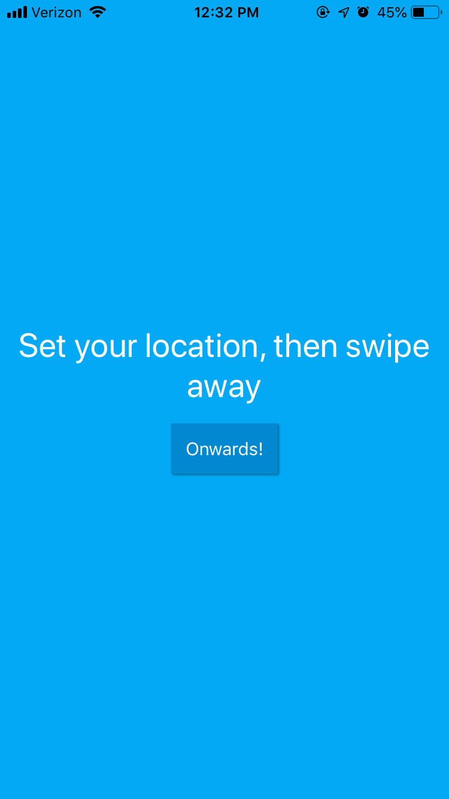
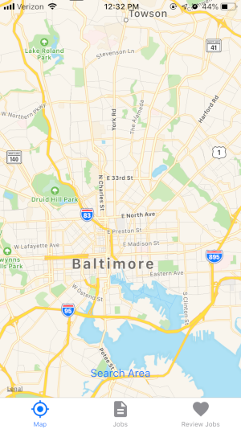
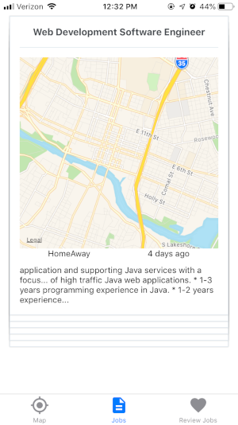
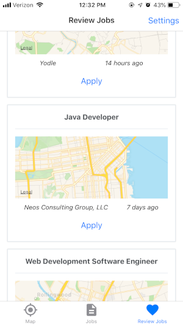

# Job Finder

A small app built with React Native and Expo.
Allows you to search an area on the map and save the jobs you wish to apply to.

    

### Install

To install and use with Expo:

```
expo install
cd jobfinder
expo start
```
### Still in Development Mode

You will need to create a client ID file with your own ID.
For example:

```
let { type, accessToken } = await Expo.Google.logInAsync({
	androidClientId: YOUR_ANDROID_CLIENT_ID,
    	iosClientId: YOUR_IOS_CLIENT_ID,
   	scopes: ['profile', 'email'],
    	behavior: 'web'
});
```

